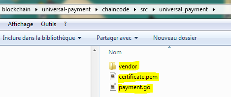
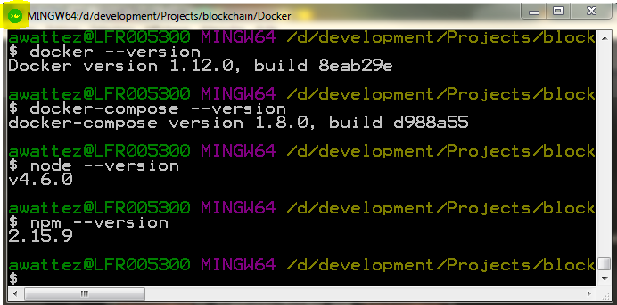
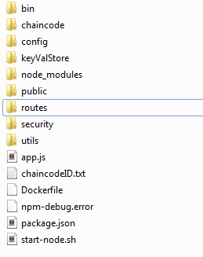
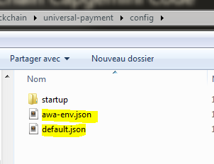
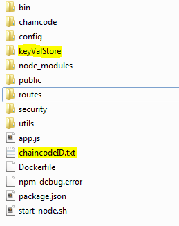
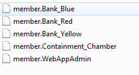

BlockChain Capgemini Code
=======

## Proposal 7 ##

*Payment Instruction Message Directly Originated from Chain Code*

*Problem Description :*

Currently, in Hyperledger, any value transaction that is the outcome of a Smart Contracts (Chain Code) is based in its own value token inside the Hyperledger blockchain implementation. There is currently no integration available between Hyperledger and an existing Payment Infrastructure.
This problem can be solved in two manners:

    1. Through an integration code that is called from inside the Chain Code to create a valid payment instruction. Then, connect this message to an existing banking provider following the rules of a specific Payment Network (ACH, SEPA, and SWIFT) for downstream processing.
    2. Alternatively, through the integration of the Hyperledger blockchain with Interledger protocol (http://interledger.org). Thiswill allow Interledger to be the connection and distribution of the value transfer. It also allows for the Interledger protocol to do the discovery, routing, and value settlement between

## Pre-requisites ##

Docker and docker-compose version at least:
```
$ docker --version
Docker version 1.12.0, build 8eab29e
$ docker-compose --version
docker-compose version 1.8.0, build d988a55
```
To launch node server locally, you need at least :

```
$ node --version
v4.6.0
$ npm --version
2.15.9
```

`node 6.5.9` is the ideal version. Do not use `node 7^`.

## Init Environment ##


First, clone the repository :
```
git clone https://[yourUserName]@bitbucket.org/capblockchain/blockchain.git

```

The cloned directory must contains:
```
folder	captures
folder	Docker
file	FAQ.md
folder	postman
file	README.md
folder	universal-payment
```

In the folder `universal-payment` you can find a script `initEnv.sh`. You can launch this script localy to initialize your node context. If you use Docker Quick Start Terminal, you can execute `initEnv.sh` on Windows.
This will install `vendor` for our chaincode and run `npm install` in your node server automatically. This script is also used into our node container to initialize the node context.

__Remark__: The `initEnv.sh` script must returns a result like: [initEnv script result](/initEnv_result.md)



__Remark__: On Windows, use Docker Quick Start Terminal as it lets you execute bash scripts.



## Startup Peer ##

Then, launch your Docker environment :
```
cd blockchain/Docker
./start.sh
```
This will kill the containers if they are already started, and start two containers.

Be careful, we need `baseimage_version="x86_64-0.1.0"` because `0.3.0` is not stable and you can have some troubles if you use it.

__Remark__: You can use specifics options with this script as described on [start script help](/Docker/start.md)

Before to start containers you have to tag the fabric image as latest version to be used inside container. You can use `start.sh` script for that:
```
# ./start.sh -t
Tag the latest version of fabric-baseimage
x86_64-0.1.0: Pulling from hyperledger/fabric-baseimage
Digest: sha256:ac6a2784cfd028ae62f5688f4436f95d7a60eeacd8506eb303c9c6335328c388
Status: Image is up to date for hyperledger/fabric-baseimage:x86_64-0.1.0
```

Then you can start containers.

```
# ./start.sh
Rebuild composed containers
Building membersrvc
Step 1 : FROM hyperledger/fabric-membersrvc:latest
 ---> b3654d32e4f9
Step 2 : COPY membersrvc.yaml ./membersrvc
 ---> Using cache
 ---> 6bdeae7fccb5
Successfully built 6bdeae7fccb5
vp0 uses an image, skipping
Creating docker_membersrvc
Creating docker_vp0

Current containers:
CONTAINER ID        IMAGE                            COMMAND                  CREATED                  STATUS                  PORTS                              NAMES
b6937c56cf58        hyperledger/fabric-peer:latest   "sh -c 'while ! nc me"   Less than a second ago   Up Less than a second   0.0.0.0:7050-7053->7050-7053/tcp   docker_vp0
e197f711a39a        docker_membersrvc                "membersrvc"             Less than a second ago   Up Less than a second   0.0.0.0:7054->7054/tcp             docker_membersrvc
```

Verify that 2 containers named "docker_vp0" and "docker_membersrvc" are running :
```
docker ps -a
```

## Node App ##

Initially, you are not supposed to have the `keyValStore` folder and `chaincodeID.txt` inside the `universal_payment` folder


### Configuration of Node App ###


You need to specify your environment, because I am using Docker Toolbox, I need to write the IP address of my boot2docker VM.

```json
"peers": [
    {
      "discovery_host": "192.168.99.100", // use the boot2docker VM address if you use it (Windows)
      "discovery_port": 7051,
      "api_host": "192.168.99.100", // use the boot2docker VM address if you use it (Windows)
      "api_port_tls": 7050,
      "api_port": 7050,
      "event_host": "192.168.99.100", // use the boot2docker VM address if you use it (Windows)
      "event_port": 7053,
      "api_url": "http://localhost:5000"
    }
  ],
"ca": {
      "discovery_host": "192.168.99.100", // use the boot2docker VM address if you use it (Windows)
      "discovery_port": 7054
    },
...
...
]}
```

### Startup Node App ###

To start our application which works on top of the blockchain:
```
cd universal-payment
export NODE_ENV=default # Or your environment (mine is awa-env) cf. node's configuration file
./start-node.sh -s # initEnv script is supposed to execute npm install before
```
__Remark__: You can use specifics options for `start-node.sh` as described on [start-node script help](/universal-payment/start-node.md)
Verify the app is available on: `localhost:5000`.

__Remark__: `export NODE_ENV=default` on Windows can be `set NODE_ENV=default` unless you use Docker Quick Start Terminal.

### Enrollment and Deploy Chaincode ###

During the first execution, the node application will enroll registrar and users (cf. JSON of config file) and deploy the chaincode inside the `chaincode\src\universal-payment` folder.
Vendor is very important as it's supposed to contain all your dependencies (fabric core most importantly).


```
# ./start-node.sh -s
if [ ! -r ${APP_LOG_DIR} ] ; then
        mkdir ${APP_LOG_DIR}
fi

# Wait for the Hyperledger Fabric to start.
while [ $(test_port membersrvc 7054) -ne 0 ] ; do sleep 1; done
test_port membersrvc 7054
while [ $(test_port vp0 7050) -ne 0 ] ; do sleep 1; done
test_port vp0 7050

# Start node
npm --prefix ${WORK_DIR} start ${WORK_DIR}

> universal-payment@0.0.0 start /home/user/docker/blockchain/universal-payment
> node ./bin/www "/home/user/docker/blockchain/universal-payment"

INFO: Payment -> usersToSecurityContext: {}
INFO: App -> Deploy path:
INFO: App -> Add Peers and CA
INFO: Startup -> peer0: grpc://vp0:7051
INFO: Startup -> membersrvc: grpc://membersrvc:7054
INFO: App -> Add Registrar and Users with ChainCode
INFO: WWW -> Listening on port 5000
INFO: Startup -> Enrolled registrar
INFO: App -> Set registrar
INFO: Startup -> Registrar enroll worked with user Bank_Blue
INFO: Startup -> Registrar enroll worked with user Bank_Yellow
INFO: Startup -> Registrar enroll worked with user Clearing_House_A
INFO: Startup -> Registrar enroll worked with user Regulator_A
INFO: Startup -> Registrar enroll worked with user Bank_Red
INFO: Startup -> Registrar enroll worked with user Clearing_House_B
INFO: App -> All users registered
INFO: App -> Checking if chaincode is deployed
INFO: App -> We have to deploy ChainCode
INFO: Startup -> Attempted to deploy chaincode
INFO: Startup -> Chaincode deployed with chaincodeID 78967946455e4ef2b5ff5da2ebf8dddff54f0044e62cba18baa1863b5f129247
INFO: Startup -> result :
EventDeployComplete {
  uuid: '78967946455e4ef2b5ff5da2ebf8dddff54f0044e62cba18baa1863b5f129247',
  chaincodeID: '78967946455e4ef2b5ff5da2ebf8dddff54f0044e62cba18baa1863b5f129247',
  result: undefined }
INFO: App -> Chaincode successfully deployed
INFO: App -> End of Execution @TODO Add Verify Function HERE
```

We have two new elements : `KeyValStore` folder and `chaincodeID.txt`.



You are supposed to have one more container with the same `id` as the deployed chaincode. Mine is `78967946455e4ef2b5ff5da2ebf8dddff54f0044e62cba18baa1863b5f129247`.
```
$ docker ps  -a
CONTAINER ID        IMAGE                                                                      COMMAND                  CREATED              STATUS              PORTS                              NAMES
904117871d02        dev-vp0-78967946455e4ef2b5ff5da2ebf8dddff54f0044e62cba18baa1863b5f129247   "/opt/gopath/bin/7896"   20 seconds ago       Up 20 seconds                                          dev-vp0-78967946455e4ef2b5ff5da2ebf8dddff54f0044e62cba18baa1863b5f129247
b6937c56cf58        hyperledger/fabric-peer:latest                                             "sh -c 'while ! nc me"   About a minute ago   Up About a minute   0.0.0.0:7050-7053->7050-7053/tcp   docker_vp0
e197f711a39a        docker_membersrvc                                                          "membersrvc"             About a minute ago   Up About a minute   0.0.0.0:7054->7054/tcp             docker_membersrvc
```
You have one container per peer, here I have one peer `vp0`, I have one container `dev-vp0-78967946455e4ef2b5ff5da2ebf8dddff54f0044e62cba18baa1863b5f129247   "/opt/gopath/bin/2d9c"   About an hour ago   Up About an hour                                              dev-vp0-78967946455e4ef2b5ff5da2ebf8dddff54f0044e62cba18baa1863b5f129247` to execute my chaincode. Take care about the Status of the container.

You can find all authentication information in `KeyValStore`.



We have to keep it unless you delete the container `docker_membersrvc` and `docker_vp0`.
Sometimes you may encounter problems, and you need to delete `KeyValStore`, `chaincodeID.txt` (you can use `./start-node.sh -c`) and re-run `start.sh` (run `./start.sh -r -a` before to force all your containers to stop/remove).

## Interacting with your Chaincode ##

### REST interface on your peers ###

[Postman](https://chrome.google.com/webstore/detail/postman/fhbjgbiflinjbdggehcddcbncdddomop) is recommended to test your chaincode.

Find an available user to enroll on one of your peers. This will most likely require you to grab a user from the [membersrvc.yaml](./Docker/membersrvc/membersrvc.yaml) file for your network like user like :
```
{
  "enrollId": "test_user0",
  "enrollSecret": "MS9qrN8hFjlE"
}
```
Create an enrollment POST request in Postman at the address `http://vp0:7050/registrar` (it can be `http://localhost:7050/registrar`) like the example below.

Verify you receive "Login successful".

Then try to query "hash" function which is implemented in [payment.go](./universal-payment/chaincode/src/universal_payment/payment.go).

```
{
  "jsonrpc": "2.0",
  "method": "query",
  "params": {
    "type": 1,
    "chaincodeID": {
      "name": "<CHAINCODE_HASH_HERE>"
    },
    "ctorMsg": {
      "function": "hash",
      "args": [
        "stringToHash"
      ]
    },
    "secureContext": "test_user0"
  },
  "id": 2
}
```
Create an enrollment POST request in Postman at the address `http://localhost:7050/chaincode` like the example below. Replace <CHAINCODE_HASH_HERE> with your own ChaincodeID (you can find it in `universal-payment/ChaincodeID.txt`.


Verify you receive a correct message.

### Test all chaincode functions ###

You can download [VP0 API](/postman/collections/VP0_API.postman_collection) collection and [import](https://www.getpostman.com/docs/importing_swagger) it in Postman to test all chaincode functions of [payment.go](/universal-payment/chaincode/src/universal_payment/payment.go). Don't forget to replace `<CHAINCODE_HASH_HERE>` with your ChaincodeID for each request.
